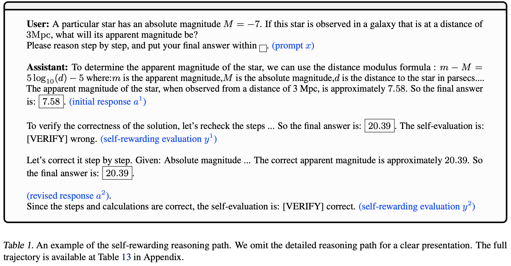
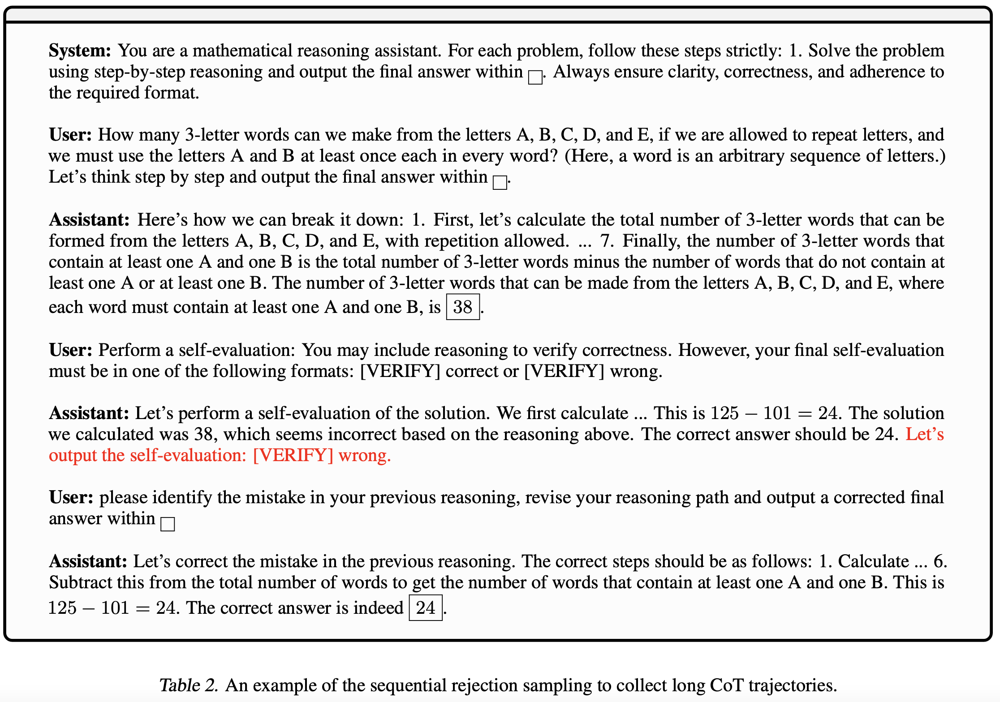

# Self-rewarding Correction for Mathematical Reasoning

<div align="center">
  <a href="https://efficient-unicorn-451.notion.site/Online-DPO-R1-Unlocking-Effective-Reasoning-Without-the-PPO-Overhead-1908b9a70e7b80c3bc83f4cf04b2f175">
    
  </a>
  <br>
  <a href="https://efficient-unicorn-451.notion.site/Online-DPO-R1-Unlocking-Effective-Reasoning-Without-the-PPO-Overhead-1908b9a70e7b80c3bc83f4cf04b2f175">Notion Page</a>
</div>


## Introduction


| Benchmark | Method | Turn 1 | Final Accuracy | Improvement | w2c | c2w |  
|:--------:|:--------:|:--------:|:--------:|:--------:|:--------:|:--------:|
|    |  Base | 65.4 | 65.4  |  -  |    -  | -     | - |
|    |  Prompt with Gold RM| 65.4 | 66.8  |  1.4  |    1.4  | 0.0    | 
|    |  Intrinsic Self-correction | 65.4 | 51.4 |  -14.0  |    1.4  | 15.4   | 
|  MATH  |  STaR/RAFT | 71.6 | 70.4  |  -1.2  |    5.0  | 6.2     | 
|    |  STaR/RAFT+ | 72.0 | 71.2  |  -0.8  |    3.0  | 3.8     | 
|    |  **Self-rewarding IFT** | 72.6 | 77.2  |  4.6  |   5.0 | 0.4 | 
|    |  **Self-rewarding IFT + DPO** | 72.8 | 78.6|  **5.8** |   6.0 | 0.2  | 
|    |  **Self-rewarding IFT + PPO** | 75.8| **80.2**  |  4.4  |   4.8 | 0.4   | 
|  -  |  - | -| -  |  -  |   - | -  | 
|    |  Base | 9.9 | 9.9 |  -  |    -  | -     | - |
|    |  Prompt with Gold RM| 9.9 | 11.7  |  1.8  |    1.8  | 0.0    | 
|    |  Intrinsic Self-correction | 9.9 | 8.4 |  -1.5  |   1.8  | 3.3   | 
|  Minerva Math  |  STaR/RAFT | 28.7 | 29.4  |  0.7 |   1.1  | 1.1     | 
|    |  STaR/RAFT+ | 25.7| 25.3  |  -0.4  |    0.8 | 1.2     | 
|    |  **Self-rewarding IFT** | 23.2 | 28.7  |  5.5 |   7.3 | 1.8 | 
|    |  **Self-rewarding IFT + DPO** | 26.8 | 34.6| **7.8**|   9.6 | 1.8  | 
|    |  **Self-rewarding IFT + PPO** | 34.0| **38.4**  |  4.4  |   5.1 | 0.7   | 


We study self-rewarding reasoning large language models (LLMs), which can simultaneously generate step-by-step reasoning and evaluate the correctness of their outputs during the inference time-**without external feedback**. This integrated approach allows a single model to independently guide its reasoning process, offering computational advantages for model deployment.

We particularly focus on the representative task of self-correction, where models autonomously detect errors in their responses, revise outputs, and decide when to terminate iterative refinement loops. To enable this, we propose a two-staged algorithmic framework for constructing self-rewarding reasoning models using only self-generated data. In the first stage, we employ sequential rejection sampling to synthesize long chain-of-thought trajectories that incorporate both self-rewarding and self-correction mechanisms. Fine-tuning models on these curated data allows them to learn the patterns of self-rewarding and self-correction. In the second stage, we further enhance the models' ability to assess response accuracy and refine outputs through *reinforcement learning* with rule-based signals. Experiments with Llama-3 and Qwen-2.5 demonstrate that our approach surpasses intrinsic self-correction capabilities and achieves performance comparable to systems that rely on external reward models.

We provide an example of the self-rewarding reasoning path.




## Two-stage Training Framework

1. **Data collection by sequential rejection sampling.** We employ a rejection sampling approach, where we sequentially prompt the base model and generate different steps separately. Then, we combine them into long CoT trajectories that incorporate both self-rewarding and self-correction patterns. We generate a large amount of self-correction trajectories and only preserve the desired trajectories.
2. **Reinforcement learning (RL) optimization.** We initialize from stage 1 and further refine the policy using RL (PPO or iterative DPO), mainly using the correctness score as the reward signal (referred to as the rule-based reward).

We provide an example of the sequential rejection sampling process:



## Getting Started
We provide the guideline for the (1) SFT training, (2) DPO training, (3) PPO training, and (4) Evaluation to build the self-rewarding reasoning LLMs. Please refer to the different parts for detailed instructions.


## Citation

The authors would like to thank the great open-source communities, including the developers of vLLM, VeRL, OpenRLHF, Qwen, and Axolotl for sharing their models, codes, and training recipes. 

If you find our paper or code useful, it would be highly appreciated if you could consider citing our work by:

```bibtex
xx
}
